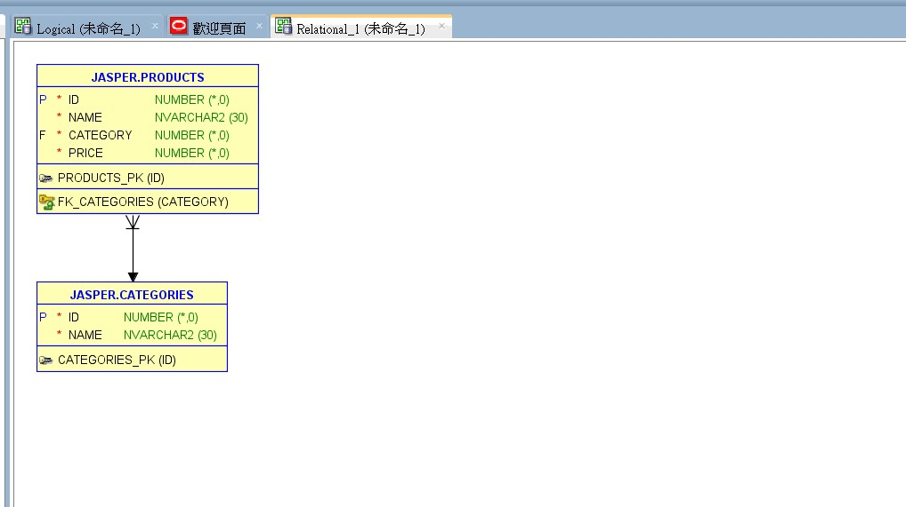

# 如何利用 Oracle SQL Developer Data Modeler 由資料庫產生 ER 圖
## How to generate ER diagram from existing DB by Oracle SQL Developer Data Modeler

## 前言

最近專案的資料庫為 Oracle, 部份 table 是由客戶自行設計及管理, 並沒有什麼明確的文件可供參考, 不清楚 table 之間的關聯性.    

經上網查詢, 發現 Oracle SQL Developer Data Modeler 可由現行資料庫的結構, 反轉為 ER 圖的功能, 可以看出 table 的關聯性, 故演練一下, 並作成筆記.  

當然, **table 之間必須要建立 Primary Key, Foreign Key 的關聯, 否則轉出的 ER 圖, 其效果不大**.  
 
<!-- more -->

## 環境

參考 <a href="https://www.jasperstudy.com/2024/03/oracle-cdb-pdb.html" target="_blank">Oracle 的容器資料庫(CDB) 與 可拔插資料庫(PDB)</a> 建置 Oracle 的測試環境, 並執行以下 SQL 指令, 建立測試資料.  
1.. 移除 View / Table  
```sql
BEGIN
   EXECUTE IMMEDIATE 'DROP VIEW vwProducts';
EXCEPTION
   WHEN OTHERS THEN
      IF SQLCODE != -942 THEN
         RAISE;
      END IF;
END;
/
BEGIN
   EXECUTE IMMEDIATE 'DROP TABLE Products';
EXCEPTION
   WHEN OTHERS THEN
      IF SQLCODE != -942 THEN
         RAISE;
      END IF;
END;
/
BEGIN
   EXECUTE IMMEDIATE 'DROP TABLE Categories';
EXCEPTION
   WHEN OTHERS THEN
      IF SQLCODE != -942 THEN
         RAISE;
      END IF;
END;
/
```

2.. 建立 Table / View  
```sql
-- ===========================
-- Create Table / View
-- ===========================
-- Creating the Categories Table
CREATE TABLE Categories
(
  Id     INT PRIMARY KEY,
  Name   NVARCHAR2(30) NOT NULL
);
/
-- Creating the Products Table
CREATE TABLE Products
(
  Id        INT PRIMARY KEY,
  Name      NVARCHAR2(30) NOT NULL,
  Category  INT NOT NULL,
  Price     INT NOT NULL,
  CONSTRAINT FK_Categories FOREIGN KEY (Category)
      REFERENCES Categories (Id)
);
/
-- Creating the vwProducts View
CREATE VIEW vwProducts AS
SELECT  P.*, C.Name AS CategoryName
FROM    Products P
LEFT JOIN Categories C ON (P.Category = C.Id);
/
```

3.. 建立測試資料  
```sql
-- 當使用 INSERT ALL 語句進行多筆插入時, 需要在最後加上 SELECT * FROM DUAL 是為了正確結束 INSERT ALL語句. 
-- 這是 Oracle 進行多筆插入的慣用法.

-- Inserting into Categories
INSERT ALL
   INTO Categories (Id, Name) VALUES (1, '餅乾類')
   INTO Categories (Id, Name) VALUES (2, '蛋糕類')
   INTO Categories (Id, Name) VALUES (3, '奶酪類')
SELECT * FROM dual;
/
-- Inserting into Products
INSERT ALL
   INTO Products (Id, Name, Category, Price) VALUES (1, '夏威夷豆塔', 1, 50)
   INTO Products (Id, Name, Category, Price) VALUES (2, '堅果塔', 1, 55)
   INTO Products (Id, Name, Category, Price) VALUES (3, '養生堅果', 1, 60)
   INTO Products (Id, Name, Category, Price) VALUES (4, '乳酪塔', 1, 60)
   INTO Products (Id, Name, Category, Price) VALUES (5, '檸檬塔', 1, 60)
   INTO Products (Id, Name, Category, Price) VALUES (6, '草莓塔', 1, 65)
   INTO Products (Id, Name, Category, Price) VALUES (7, '輕乳酪蛋糕(片)', 2, 65)
   INTO Products (Id, Name, Category, Price) VALUES (8, '重乳酪蛋糕(片)', 2, 70)
   INTO Products (Id, Name, Category, Price) VALUES (9, '抹茶奶酪', 3, 90)
   INTO Products (Id, Name, Category, Price) VALUES (10, '草莓奶酪', 3, 85)
   INTO Products (Id, Name, Category, Price) VALUES (11, '芒果奶酪', 3, 85)
   INTO Products (Id, Name, Category, Price) VALUES (12, '紅豆奶酪', 3, 80)
SELECT * FROM dual;
/
COMMIT;
/
```

## 作法

1.. [匯入] / [資料字典].  
  

2.. 選取連線.  
  
註: 如果沒有資料庫連線, 則要自行按 [新增] 建立一個.  

3.. 選取 Schema.  
  

4.. 選取 Table.  
  

5.. 選取 [完成].  
  

6.. 日誌的部份, 若不需要, 直接按 [關閉].  
  

7.. 呈現 ER Model.  
  

8.. 改一下 model 的名稱.  
由 "Relational_1" 改為 "CookiesModel_1"  
  


9.. 匯出為 影像檔案.  
  

選擇存為 PNG 檔  
  

10.. 將設計存檔, 以供後續使用.  
會存成一個 .dmd 的檔案, 是一個 xml 檔案, 細節不是很清楚, 但至少知道要存檔, 後續才能再叫出來使用.  

  
  

```
<?xml version = '1.0' encoding = 'UTF-8'?>
<OSDM_Design class="oracle.dbtools.crest.model.design.Design" name="Cookies" id="F1C4712A-480B-A8D9-A349-67722CF5B6F6" version="3.5">
<createdBy>jasperlai</createdBy>
<createdTime>2024-05-15 02:53:03 UTC</createdTime>
<ownerDesignName>Cookies</ownerDesignName>
<capitalNames>false</capitalNames>
<designId>F1C4712A-480B-A8D9-A349-67722CF5B6F6</designId>
</OSDM_Design>
```

11.. 開啟設計.  

  
  
  

## 參考文件

* <a href="https://www.oracle.com/database/sqldeveloper/technologies/download/" target="_blank">Oracle SQL Developer 下載</a>  

* <a href="https://marketplace.visualstudio.com/items?itemName=Oracle.sql-developer" target="_blank">Oracle SQL Developer Extension for VSCode 下載</a>  
> 筆者在使用 Oracle SQL Developer 時, 中文會是亂碼, 參考一些網路上的方法, 但並未解決. 後來發現 VS Code 有這個 extension, 在 VS Code 執行, 中文就正常了.  
  

* <a href="https://www.oracle.com/database/sqldeveloper/technologies/sql-data-modeler/download/" target="_blank">Oracle SQL Developer Data Modeler 下載</a>  

* <a href="https://holowczak.com/reverse-engineer-a-data-model-oracle-sql-developer/" target="_blank">(2015.09) Reverse Engineering a Data Model using Oracle SQL Developer</a>  


